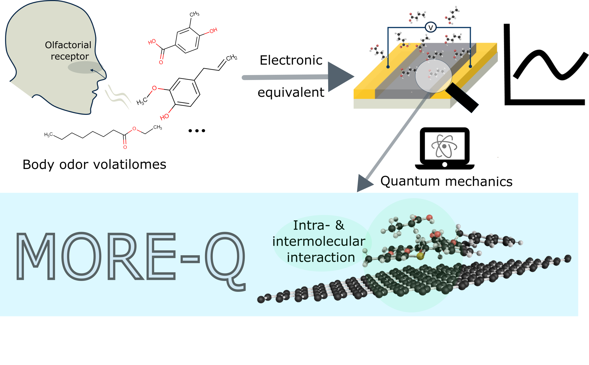

[](https://www.nature.com/articles/s41597-025-04616-6)
[](https://chemrxiv.org/engage/chemrxiv/article-details/66e08e0151558a15ef9d26f6)
[](https://github.com/LiC1117/MORE-Q/blob/main/README.md#Citation)

##




## About
**MORE-Q(X)** dataset **and MORE-ML** aim at providing a fundamental understanding of the interaction of mucin-derived olfactorial receptor and body odor volatilomes (BOVs) and hence the design principles towards sensing performance enhancement using quantum mechanics and machine learning.

### Motivation for MORE-QX
To approximate the thermodynamic ensemble and the conformer effects, we expanded the MORE-Q dataset into MORE-QX by sampling multiple low-energy BOV–receptor dimer (DM) conformers adsorbed on graphene. This process increased the number of BOV–receptor–graphene complexes from 1,836 to 10,441, leading to exMORE-G-Q1, exMORE-G-Q2, and exMORE-G-Q3 subsets. The only difference in the HDF5 structure between the MORE-Q and MORE-QX subsets is that we added 'DM' keys after the 'REC' and 'OM' keys as indicators for the low-energy conformers taken from the dimer subset exMORE-G-Q2. 

## Usage

- [ ] MORE-Q
In this folder, one could find one jupyter-notebook file __MORE-Q_user_guide.ipynb__ and one python script __createDF.py__. __MORE-Q-user-guide__ contains step-by-step codes for data extraction from HDF5 files using __createDF.py__ and reproduction of the technical validation figures. 

One can download MORE-Q **HDF5 files** from ZENODO under the link: https://zenodo.org/records/13741197

- [ ] MORE-QX
In this folder, one could find one jupyter-notebook file __MORE-ML_user_guide.ipynb__ and one python script __ex_createDF.py__. 
__MORE-QX-user-guide__ contains step-by-step codes for data extraction from HDF5 files using __createDF.py__ and the usage of __MORE-ML__ framework including regression and explanation

One can download MORE-QX **HDF5 files** from ZENODO under the link: https://zenodo.org/records/14720508

- [ ] Example for a new system
We also provide a brief example how to obtain the input features for a new BOV-receptor-surface complex system, which could be used in the MORE-ML framework to predict binding features.

## Citation
If you use parts of the MORE-Q, MORE-QX data, and MORE-ML framework please cite

```
Chen, L., Medrano Sandonas, L., Traber, P. et al. MORE-Q, a dataset for molecular olfactorial receptor engineering by quantum mechanics.
Sci Data 12, 324 (2025).
https://doi.org/10.1038/s41597-025-04616-6
```

Manuscript for MORE-QX and MORE-ML coming soon.


